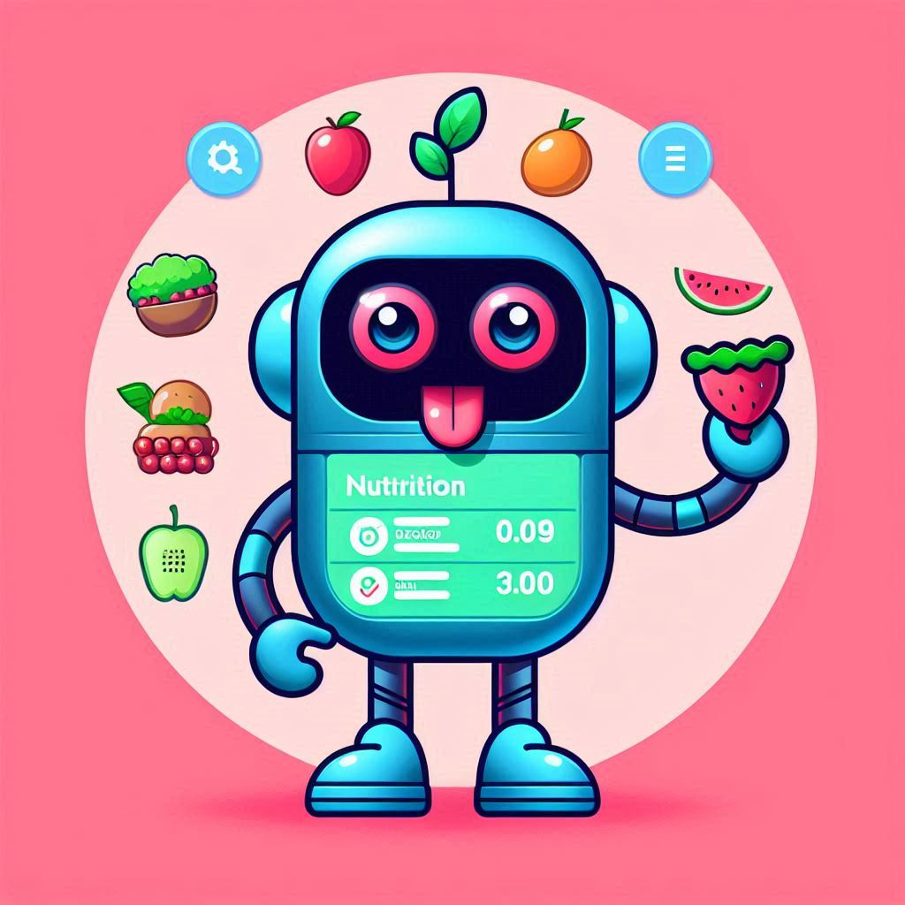

# Bite Buddy Bot (BBB)

 

  
  

<!-- TABLE OF CONTENTS -->

  
Table of Contents

  <ol>
    <li>
      <a href="#summary">Summary</a>
    </li>
    <li>
      <a href="#bot-features">Bot Features</a>
      <ul>
        <li><a href="#features-list">Features List</a></li>
        <li>
          <a href="#features-examples">Features Examples</a>
          <ul>
            <li>
              <a href="#main-menu">Main Menu</a>
              <ul>
                <li><a href="#add-food">Add Food</a></li>
                <li><a href="#get-food-info">Get Food Info</a></li>
                <li>
                  <a href="#generate-report">Generate Report</a>
                  <ul>
                    <li><a href="#daily-report">Daily Report</a></li>
                    <li><a href="#report-by-category">Report by Category</a></li>
                  </ul>
                </li>
                <li>
                  <a href="#generate-chart">Generate Chart</a>
                  <ul>
                    <li><a href="#average-pie-chart-division">Average Pie Chart Division</a></li>
                    <li><a href="#calories-bar-chart">Calories Bar Chart</a></li>
                  </ul>
                </li>
                <li>
                  <a href="#gemini">Gemini</a>
                  <ul>
                    <li><a href="#ai-advice">AI Advice</a></li>
                    <li><a href="#ai-user-question">AI User Question</a></li>
                  </ul>
                </li>
              </ul>
            </li>
          </ul>
        </li>
      </ul>
    </li>
    <li>
      <a href="#technologies-used">Technologies Used</a>
    </li>
    <li><a href="#instructions-for-developers">Instructions for Developers</a></li>
      <ul>
        <li><a href="#prerequisites">Prerequisites</a></li>
        <li><a href="#setup">Setup</a></li>
        <li><a href="#running-the-bot">Running the bot</a></li>
      </ul>
    <li>
      <a href="#code-contributors">Code Contributors</a>
    </li>
  </ol>

<!-- SUMMARY -->
## Summary

Bite Buddy Bot (BBB) is a **Nutrition Tracker Telegram bot** that helps users track their daily food intake without
 needing a separate app.

> [!NOTE]
> The [original bot](https://web.telegram.org/k/#@Bite_Buddy_Bot) currently isn't running continuously on a server. 
> Please follow the instructions [below](#instructions-for-developers) to run the bot on your local machine.

> [!NOTE]
> This bot started as hackathon team project for the "Developer Boost" program at Google and Reichman Tech School. 
> Since the original project is private, it cannot be linked. It contains a GitHub tasks project with 22 closed issues
>  & 29 closed pull requests categorized by code versions: v0, v1 and v2. 
> This repository is my personal continuation of the original project with new features and improvements.

<!-- BOT FEATURES -->
## Bot Features
### Features List

- **View Food's nutrition values**: Users can view the following nutrition details of a specific food:
  - Calories
  - Protein
  - Carbohydrates
  - Total Fat
  - Sodium
  - Potassium
  - Cholesterol
  - Sugars

- **Add Food**: Users can log what they have eaten each day.
- **Generate Reports**: Users can generate reports based on specific dates or categories to analyze their eating habits.  
- **Generate charts**: Users can generate charts based on specific dates to view the calories and percentages
 of nutrition values.  
- **Ask AI**: Users can get motivational messages, advice based on their eating history,
 or ask a free-form question to an AI (Gemini).

<a href="#readme-top">back to top</a>

### Features Examples

  
#### Main Menu
(Send /start to the bot to see the main menu)

  ![Main Menu][Main-Menu]

##### Add Food
(Select "Add Food" from the menu and enter the food item you have eaten)

  ![Add Food][Add-Food]

##### Get Food Info
(Select "Get Food Info" and enter food that you want to view its nutrition values)

  ![Get Food Info][Get-Food-Info]

<a href="#readme-top">back to top</a>

##### Generate Report
(Select "Generate Report" and choose the type of report you want to generate)

###### Daily Report
  ![Generate Daily Report][Generate-Daily-Report]

###### Report by Category
  ![Generate Report by Category][Generate-Report-by-Category]

<a href="#readme-top">back to top</a>

##### Generate Chart
(Select "Generate Chart" and choose the type of chart you want to generate)

###### Average Pie Chart Division
  ![Generate Pie Chart][Generate_Pie_Chart]

###### Calories Bar Chart
  ![Generate Calories Bar Chart][Generate-Calories-Bar-Chart]

<a href="#readme-top">back to top</a>

##### Gemini
(Select "Ask AI" to get motivations or advices from an AI)

###### AI Advice
  ![AI Advice][AI-Advice]

###### AI User Question
  ![AI User Question][AI-User-Question]
  

<a href="#readme-top">back to top</a>

<!-- TECHNOLOGIES USED -->
## Technologies Used

**Python**: The primary programming language used for the bot.  
**Matplotlib**: Used for generating charts.  
**MongoDB**: Used for storing user data and food history.  
**pyTelegramBotAPI**: A Python wrapper for the Telegram Bot API.  
**Nutritionix API**: Used for fetching food information.  
**Google-genai (Gemini)**: Used for AI advice and user questions.  

<a href="#readme-top">back to top</a>

<!-- INSTRUCTIONS FOR DEVELOPERS -->
## Instructions for Developers
### Prerequisites
- [uv](https://docs.astral.sh/uv/getting-started/installation/) (uv can install python and all dependencies for you)
- [MongoDB](https://www.mongodb.com/)
- [Telegram API](https://pypi.org/project/pyTelegramBotAPI/)
- [Matplotlib](https://matplotlib.org/)
- [Google-genai](https://cloud.google.com/vertex-ai/generative-ai/docs/sdks/overview)

<a href="#readme-top">back to top</a>

### Setup
- Clone this repository
- Navigate (cd) into the project directory
- Get an API Token for a Telegram bot via the [BotFather](https://telegram.me/BotFather)
- Sign Up to [Nutritionix](https://developer.nutritionix.com/signup) to receive your nutritionix API Token & App ID.
- Get a Token for the Gemini API via the [Google AI Studio](https://aistudio.google.com/app/apikey)
- Create a `bot_secrets.py` file with your bot token, nutritionix token & id, and gemini token:

      BOT_TOKEN = "XXXXXXXXXX:XXXXXXXXXXXXXXXXXXXXXXXXXXXXXXXXXXX"
      nutrition_x_api = "XXXXXXXXXXXXXXXXXXXXXXXXXXXXXXXX"
      nutrition_x_app_id = "XXXXXXXX"
      gemini_api = "XXXXXXXXXXXXXXXXXXXXXXXXXXXXXXXXXXXXXX"

> [!NOTE]
> All the above tokens are sensitive information, so make sure to keep them safe and not share them with anyone.

> [!NOTE]
> All these APIs are free of charge.  

<a href="#readme-top">back to top</a>

### Running the bot
- Run the bot (This will also install Python 3.13 and all dependencies):

      uv run bot.py

> [!NOTE]
> Make sure to have MongoDB running on your local machine or have a MongoDB Atlas account.

<a href="#readme-top">back to top</a>

<!-- CODE CONTRIBUTORS -->
## Code Contributors

The B.O.M Squad:
- **B**ayan kassem
- **O**r Hasan
- **M**ohammad Imad

<a href="#readme-top">back to top</a>

<!-- MARKDOWN LINKS & IMAGES -->
[BBB-Icon]: Media/Bite_Buddy_Bot_Profile_Picture_v.2.png
[Main-Menu]: Media/Examples/Main_Menu.png
[Add-Food]: Media/Examples/Add_Food.png
[Not-a-Food]: Media/Examples/Add_Food_-_Not_a_Food.png
[Get-Food-Info]: Media/Examples/Get_Food_Info.png
[Generate-Daily-Report]: Media/Examples/Generate_Daily_Report.png
[Generate-Report-by-Category]: Media/Examples/Generate_Report_by_Category.png
[Generate_Pie_Chart]: Media/Examples/Generate_Daily_Pie_Chart.png
[Generate-Calories-Bar-Chart]: Media/Examples/Generate_Daily_Calories_Bar_Chart.png
[AI-Motivation-Message]: Media/Examples/AI_Motivation_Message.png
[AI-Advice]: Media/Examples/AI_Advice.png
[AI-User-Question]: Media/Examples/AI_User_Question.png
